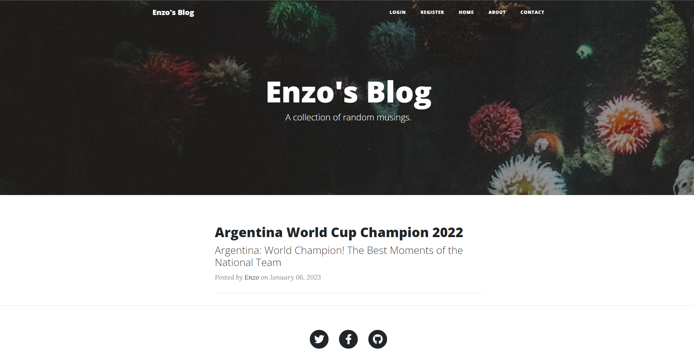

# Opinion blog capstone project

## What is this project about? 

This project is based on the idea of having a space where a single person can share their opinion or write an article on a specific topic. It also allows users to interact with each other through comments.

## Built with: 

- [Python](https://www.python.org/)
- [Flask](https://flask.palletsprojects.com/en/2.2.x/)
- HTML
- CSS
- PostgreSQL

## Live demo link

[Blog](https://enzo-blog-proyect.onrender.com)

## Author 

👤 **Enzo**
​

- Github: [@enzolonghi](https://github.com/enzolonghi)

- Linkedin: [Enzo Longhi](https://www.linkedin.com/in/enzolonghi/)

## Show your support

Give a ⭐️ if you like this project!
​

## Acknowledgments

- [Angela Yu](https://gist.github.com/angelabauer)
